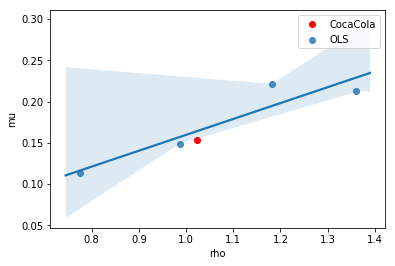

# Team 03 - UDCN
### Date Experiment: 16.30 - Nov.21,2018 - Date Analysis: 23.11 - Nov.21,2018


```python
import pandas as pd
import numpy as np
import seaborn as sn
import matplotlib.pylab as plt
import statsmodels.formula.api as smf
```


```python
data=pd.read_csv('Data_Experiment_Nov212018.csv')
# Tinh so dem - tru phong
data['N']=np.mean(data.loc[:,'N1':'N2'],axis=1)
data.loc[1:,'N']=data.loc[1:,'N'] - data.loc[0,'N']
# Tinh rho = mass / volume
data['rho']=data['Mass']/data['Volume']
# Tinh mu = -ln(I/I0) / d
d = 2.05 # cm
data['mu'] = np.NaN
N0=data.loc[1,'N'] # Gia tri I0 
data.loc[2:,'mu'] = -np.log(data.loc[2:,'N']/N0)/d
data
```


<div>
<style scoped>
    .dataframe tbody tr th:only-of-type {
        vertical-align: middle;
    }

    .dataframe tbody tr th {
        vertical-align: top;
    }

    .dataframe thead th {
        text-align: right;
    }
</style>
<table border="1" class="dataframe">
  <thead>
    <tr style="text-align: right;">
      <th></th>
      <th>Solution</th>
      <th>Mass</th>
      <th>Volume</th>
      <th>N1</th>
      <th>N2</th>
      <th>N3</th>
      <th>N</th>
      <th>rho</th>
      <th>mu</th>
    </tr>
  </thead>
  <tbody>
    <tr>
      <th>0</th>
      <td>Background</td>
      <td>0.0000</td>
      <td>100</td>
      <td>154</td>
      <td>135</td>
      <td>135</td>
      <td>144.5</td>
      <td>0.000000</td>
      <td>NaN</td>
    </tr>
    <tr>
      <th>1</th>
      <td>Source</td>
      <td>0.0000</td>
      <td>100</td>
      <td>3200</td>
      <td>3222</td>
      <td>3173</td>
      <td>3066.5</td>
      <td>0.000000</td>
      <td>NaN</td>
    </tr>
    <tr>
      <th>2</th>
      <td>Salt_Solution</td>
      <td>118.2096</td>
      <td>100</td>
      <td>2123</td>
      <td>2062</td>
      <td>2030</td>
      <td>1948.0</td>
      <td>1.182096</td>
      <td>0.221333</td>
    </tr>
    <tr>
      <th>3</th>
      <td>Sugar_Solution</td>
      <td>108.7488</td>
      <td>80</td>
      <td>2096</td>
      <td>2155</td>
      <td>2287</td>
      <td>1981.0</td>
      <td>1.359360</td>
      <td>0.213139</td>
    </tr>
    <tr>
      <th>4</th>
      <td>Water</td>
      <td>98.7284</td>
      <td>100</td>
      <td>2395</td>
      <td>2412</td>
      <td>2363</td>
      <td>2259.0</td>
      <td>0.987284</td>
      <td>0.149080</td>
    </tr>
    <tr>
      <th>5</th>
      <td>Ethanol</td>
      <td>56.5878</td>
      <td>73</td>
      <td>2563</td>
      <td>2585</td>
      <td>2634</td>
      <td>2429.5</td>
      <td>0.775175</td>
      <td>0.113586</td>
    </tr>
    <tr>
      <th>6</th>
      <td>CocaCola_Solution</td>
      <td>104.3418</td>
      <td>102</td>
      <td>2356</td>
      <td>2415</td>
      <td>2354</td>
      <td>2241.0</td>
      <td>1.022959</td>
      <td>0.152983</td>
    </tr>
  </tbody>
</table>
</div>


```python
# Phuong trinh mu = a  + b.rho
fit=smf.ols(formula='mu~rho',data=data.loc[2:5,]).fit()
fit.params
# Result: mu =  -0.037328    + 0.192176 .rho
# Phuong trinh chuan he so truyen qua: mu (cm-1) =  -0.037328    + 0.192176 .rho (g/cm3)
```


    Intercept   -0.032493
    rho          0.192176
    dtype: float64


```python
# Ve hinh
sn.regplot(x='rho',y='mu',data=data.loc[2:5,],label='OLS')
plt.plot(data.loc[6,'rho'],data.loc[6,'mu'],'ro',label='CocaCola')
plt.legend()
```

    c:\program files\python37\lib\site-packages\scipy\stats\stats.py:1713: FutureWarning: Using a non-tuple sequence for multidimensional indexing is deprecated; use `arr[tuple(seq)]` instead of `arr[seq]`. In the future this will be interpreted as an array index, `arr[np.array(seq)]`, which will result either in an error or a different result.
      return np.add.reduce(sorted[indexer] * weights, axis=axis) / sumval
    


    <matplotlib.legend.Legend at 0x244f4854d30>




