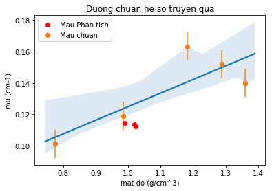

# Team 03 - UDCN
### Date Experiment: 10.00 - 16.30 -  Nov.23,2018;   Date Analysis: 06.32 - Nov.23,2018


```python
import pandas as pd
import numpy as np
import seaborn as sn
import matplotlib.pylab as plt
import statsmodels.formula.api as smf
```


```python
data=pd.read_csv('Data_Nov232018.csv')

# Tinh so dem - tru phong
data['N']=np.mean(data.loc[:,'N1':'N4'],axis=1)
data.loc[1:,'N']=data.loc[1:,'N'] - data.loc[0,'N']
# Tinh rho = mass / volume
data['rho']=data['Mass']/data['Volume']
# Tinh mu = -ln(I/I0) / d
d = 2.70 # cm
data['mu'] = np.NaN
N0=data.loc[1,'N'] # Gia tri I0 
data.loc[2:,'mu'] = -np.log(data.loc[2:,'N']/N0)/d
data

# Mau lo: d=2.7cm, be day = 0.12cm
```


<div>
<style scoped>
    .dataframe tbody tr th:only-of-type {
        vertical-align: middle;
    }

    .dataframe tbody tr th {
        vertical-align: top;
    }

    .dataframe thead th {
        text-align: right;
    }
</style>
<table border="1" class="dataframe">
  <thead>
    <tr style="text-align: right;">
      <th></th>
      <th>Solution</th>
      <th>Mass</th>
      <th>Volume</th>
      <th>N1</th>
      <th>N2</th>
      <th>N3</th>
      <th>N4</th>
      <th>N</th>
      <th>rho</th>
      <th>mu</th>
    </tr>
  </thead>
  <tbody>
    <tr>
      <th>0</th>
      <td>Background</td>
      <td>0.0000</td>
      <td>100</td>
      <td>12</td>
      <td>18</td>
      <td>9</td>
      <td>10</td>
      <td>12.25</td>
      <td>0.000000</td>
      <td>NaN</td>
    </tr>
    <tr>
      <th>1</th>
      <td>Source</td>
      <td>0.0000</td>
      <td>100</td>
      <td>5445</td>
      <td>5873</td>
      <td>5772</td>
      <td>5842</td>
      <td>5720.75</td>
      <td>0.000000</td>
      <td>NaN</td>
    </tr>
    <tr>
      <th>2</th>
      <td>Na2SO4_Solution</td>
      <td>96.5657</td>
      <td>75</td>
      <td>3859</td>
      <td>3819</td>
      <td>3736</td>
      <td>3810</td>
      <td>3793.75</td>
      <td>1.287543</td>
      <td>0.152128</td>
    </tr>
    <tr>
      <th>3</th>
      <td>Salt_Solution</td>
      <td>118.2096</td>
      <td>100</td>
      <td>3777</td>
      <td>3764</td>
      <td>3600</td>
      <td>3638</td>
      <td>3682.50</td>
      <td>1.182096</td>
      <td>0.163151</td>
    </tr>
    <tr>
      <th>4</th>
      <td>Sugar_Solution</td>
      <td>108.7488</td>
      <td>80</td>
      <td>4068</td>
      <td>3887</td>
      <td>3852</td>
      <td>3921</td>
      <td>3919.75</td>
      <td>1.359360</td>
      <td>0.140027</td>
    </tr>
    <tr>
      <th>5</th>
      <td>Water</td>
      <td>98.4848</td>
      <td>100</td>
      <td>4066</td>
      <td>4171</td>
      <td>4166</td>
      <td>4237</td>
      <td>4147.75</td>
      <td>0.984848</td>
      <td>0.119087</td>
    </tr>
    <tr>
      <th>6</th>
      <td>Ethanol</td>
      <td>56.5878</td>
      <td>73</td>
      <td>4265</td>
      <td>4392</td>
      <td>4351</td>
      <td>4452</td>
      <td>4352.75</td>
      <td>0.775175</td>
      <td>0.101219</td>
    </tr>
    <tr>
      <th>7</th>
      <td>CocaCola_Solution</td>
      <td>104.3418</td>
      <td>102</td>
      <td>4317</td>
      <td>4191</td>
      <td>4211</td>
      <td>4218</td>
      <td>4222.00</td>
      <td>1.022959</td>
      <td>0.112515</td>
    </tr>
    <tr>
      <th>8</th>
      <td>Sunlight_Solution</td>
      <td>98.9948</td>
      <td>100</td>
      <td>4247</td>
      <td>4176</td>
      <td>4155</td>
      <td>4276</td>
      <td>4201.25</td>
      <td>0.989948</td>
      <td>0.114340</td>
    </tr>
    <tr>
      <th>9</th>
      <td>Olong_Solution</td>
      <td>101.8173</td>
      <td>100</td>
      <td>4312</td>
      <td>4180</td>
      <td>4212</td>
      <td>4176</td>
      <td>4207.75</td>
      <td>1.018173</td>
      <td>0.113767</td>
    </tr>
  </tbody>
</table>
</div>


```python
# Phuong trinh mu = a  + b.rho
fit=smf.ols(formula='mu~rho',data=data.loc[2:6,]).fit()
fit.params
# Result: mu =  0.038231   +  0.086680 .rho
# Phuong trinh chuan he so truyen qua: mu (cm-1) =  -0.037328    + 0.192176 .rho (g/cm3)
```


    Intercept    0.038231
    rho          0.086680
    dtype: float64


```python
# Ve mau chuan va duong fit OLS
plt.subplots
sn.regplot(x='rho',y='mu',data=data.loc[2:6,],ci=80)
plt.errorbar(data.loc[2:6,'rho'], data.loc[2:6,'mu'], yerr=0.009,fmt='o',label='Mau chuan')
# Ve mau phan tich
plt.plot(data.loc[7:,'rho'],data.loc[7:,'mu'],'ro',label='Mau Phan tich')
# Trinh bay do thi
plt.legend(loc=2)
plt.xlabel('mat do (g/cm^3)')
plt.ylabel('mu (cm-1)')
plt.title('Duong chuan he so truyen qua')
plt.savefig('Result_figure.png',dpi=300)

```

    c:\program files\python37\lib\site-packages\scipy\stats\stats.py:1713: FutureWarning: Using a non-tuple sequence for multidimensional indexing is deprecated; use `arr[tuple(seq)]` instead of `arr[seq]`. In the future this will be interpreted as an array index, `arr[np.array(seq)]`, which will result either in an error or a different result.
      return np.add.reduce(sorted[indexer] * weights, axis=axis) / sumval
    





```python
# Phuong trinh rho = a  + b.mu
fit_revert=smf.ols(formula='rho~mu',data=data.loc[2:6,]).fit()
data['Result']=np.NaN
data.loc[7:,'Result']=fit_revert.predict({'mu':data.loc[7:,'mu']})
# danh gia sai so
data['sigma']=np.NaN
data.loc[7:,'sigma']=np.abs(data.loc[7:,'Result']-data.loc[7:,'rho'])/data.loc[7:,'rho']*100
data.to_csv('Result_Analysis.csv') 

```
